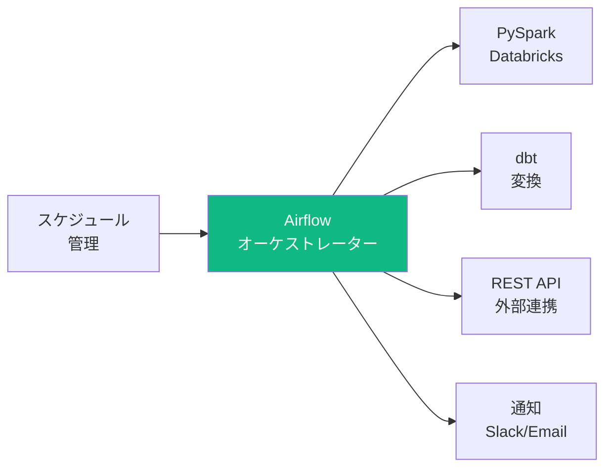
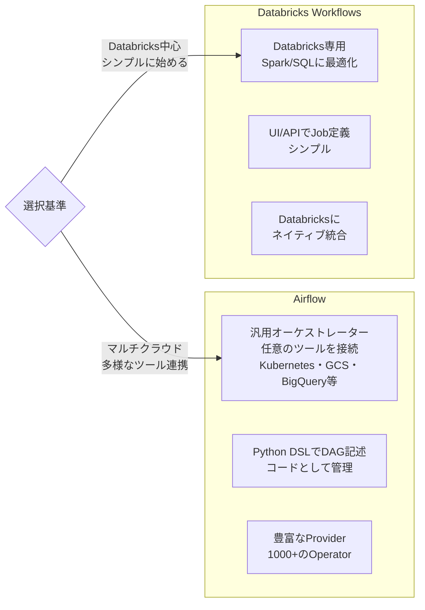
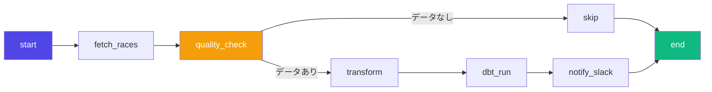
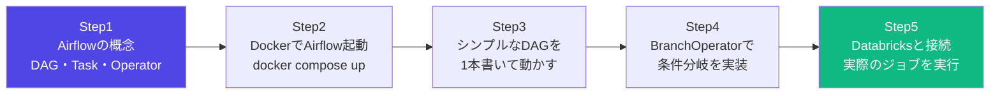

# Apache Airflow

## Airflowとは

データパイプラインをスケジュール・管理するワークフローオーケストレーターツール。



**Airflowの役割**: 「いつ・何を・どの順で実行するか」を管理する。実際の処理はSparkやdbtなど別ツールに任せる。

---

## Airflow vs Databricks Workflows



> **Databricks案件**: Databricks Workflowsを使えばAirflowなしでジョブ管理できる。どちらも概念は同じ（DAG・タスク・スケジュール）なので、どちらかを覚えればもう一方も理解しやすい。

---

## 核心概念

### DAG（Directed Acyclic Graph）



**DAGの特性**:
- **Directed（有向）**: 処理の方向が決まっている
- **Acyclic（非巡回）**: ループしない（無限ループになると困るので）
- **Graph（グラフ）**: タスクの依存関係をグラフで表現

```python
from airflow import DAG
from airflow.operators.python import PythonOperator
from datetime import datetime, timedelta

# DAG定義
with DAG(
    dag_id="keiba_pipeline",          # DAGのID（ユニークである必要がある）
    start_date=datetime(2024, 1, 1),  # いつから実行開始するか
    schedule="0 6 * * *",            # 毎朝6時（cron形式）
    catchup=False,                    # 過去分を遡って実行しない（重要！）
    tags=["keiba", "daily"],
    default_args={
        "owner": "me",
        "retries": 2,                 # 失敗時のリトライ回数
        "retry_delay": timedelta(minutes=5),  # リトライ間隔
        "email_on_failure": True,
        "email": ["you@example.com"],
    }
) as dag:
    pass
```

> **catchup=False は重要**: Trueにすると `start_date` から現在まで全ての実行をbackfillする。初回デプロイ時に大量のDAGが走り出す罠。

---

## Task と Operator

```python
from airflow.operators.python import PythonOperator, BranchPythonOperator
from airflow.operators.bash import BashOperator
from airflow.operators.empty import EmptyOperator

# Python処理
def fetch_race_data(**context):
    race_date = context["ds"]  # 実行日 (YYYY-MM-DD)
    print(f"{race_date} のレースデータを取得")
    return {"count": 150}  # XComで返り値を渡せる

fetch_task = PythonOperator(
    task_id="fetch_race_data",
    python_callable=fetch_race_data,
)

# Shell処理
run_dbt = BashOperator(
    task_id="run_dbt_transform",
    bash_command="cd /dbt_project && dbt run --select +races_summary",
)

# 依存関係の定義（3種類の書き方）
fetch_task >> run_dbt               # 最もシンプル
fetch_task.set_downstream(run_dbt)  # 明示的
run_dbt.set_upstream(fetch_task)    # 逆方向
```

---

## よく使うOperator

| Operator | 用途 | 例 |
|----------|------|-----|
| `PythonOperator` | Python関数を実行 | データ処理・API呼び出し |
| `BashOperator` | シェルコマンドを実行 | `dbt run`・スクリプト実行 |
| `DatabricksRunNowOperator` | Databricks Jobを実行 | Sparkジョブ実行 |
| `DatabricksSubmitRunOperator` | Databricksにnotebookを投げる | アドホック実行 |
| `HttpSensor` | APIが返ってくるまで待つ | 外部データが届くまで待機 |
| `FileSensor` | ファイルが届くまで待つ | データファイルの到着待ち |
| `BranchPythonOperator` | 条件分岐 | データ品質チェックで分岐 |
| `TriggerDagRunOperator` | 別のDAGをトリガー | DAGの連鎖 |
| `ExternalTaskSensor` | 別のDAGのタスク完了を待つ | DAG間の依存管理 |

---

## DAGの完全な例（競馬パイプライン）

```python
from airflow import DAG
from airflow.operators.python import PythonOperator, BranchPythonOperator
from airflow.operators.bash import BashOperator
from airflow.operators.empty import EmptyOperator
from airflow.providers.databricks.operators.databricks import DatabricksRunNowOperator
from datetime import datetime, timedelta

def fetch_race_results(**context):
    """JRAからレース結果を取得"""
    race_date = context["ds"]  # 実行日 (YYYY-MM-DD)
    print(f"{race_date} のレースデータを取得")
    count = 150  # 実際はAPIから取得
    # XComに値をプッシュ
    context["ti"].xcom_push(key="record_count", value=count)
    return count

def check_data_quality(**context):
    """データ品質チェック（BranchPythonOperator用）"""
    count = context["ti"].xcom_pull(
        task_ids="fetch_race_results",
        key="record_count"
    )
    if count and count > 0:
        return "run_databricks_job"  # task_idを返す
    else:
        return "skip_processing"

with DAG(
    dag_id="keiba_daily_pipeline",
    start_date=datetime(2024, 1, 1),
    schedule="0 20 * * 0,6",  # 土日の20時（レース開催日）
    catchup=False,
    default_args={
        "retries": 2,
        "retry_delay": timedelta(minutes=5),
    }
) as dag:

    start = EmptyOperator(task_id="start")

    fetch = PythonOperator(
        task_id="fetch_race_results",
        python_callable=fetch_race_results,
    )

    quality_check = BranchPythonOperator(
        task_id="check_data_quality",
        python_callable=check_data_quality,
    )

    # Databricksのジョブを実行
    run_databricks = DatabricksRunNowOperator(
        task_id="run_databricks_job",
        databricks_conn_id="databricks_default",
        job_id=12345,
    )

    # dbt実行
    run_dbt = BashOperator(
        task_id="run_dbt_transform",
        bash_command="cd /dbt_project && dbt run --select +races_summary",
    )

    skip = EmptyOperator(task_id="skip_processing")

    # none_failedは分岐したどちらかが成功すれば続く
    end = EmptyOperator(task_id="end", trigger_rule="none_failed_min_one_success")

    # 依存関係の定義
    start >> fetch >> quality_check
    quality_check >> [run_databricks, skip]
    run_databricks >> run_dbt >> end
    skip >> end
```

---

## Cron式の読み方

```
分(0-59) 時(0-23) 日(1-31) 月(1-12) 曜日(0-6, 0=日曜)

0 6 * * *        毎日6時
0 6 * * 1        毎週月曜6時
0 6 1 * *        毎月1日6時
0 */2 * * *      2時間おき（0,2,4...時）
0 0,6,12,18 * * * 1日4回（0時・6時・12時・18時）
*/15 * * * *     15分おき
0 20 * * 0,6     土日の20時（競馬パイプライン）
```

**Airflow独自のプリセット**:
| プリセット | 意味 |
|-----------|------|
| `@daily` | 毎日0時 |
| `@weekly` | 毎週日曜0時 |
| `@monthly` | 毎月1日0時 |
| `@hourly` | 毎時0分 |
| `None` | 手動のみ |

---

## XCom（タスク間のデータ受け渡し）

```python
# データをプッシュ
def push_data(**context):
    context["ti"].xcom_push(key="race_count", value=100)
    # return値も自動でXComにプッシュされる（key="return_value"）
    return "success"

# データをプル
def pull_data(**context):
    # 明示的なkey指定
    count = context["ti"].xcom_pull(
        task_ids="push_data",
        key="race_count"
    )
    # return値を取得
    status = context["ti"].xcom_pull(
        task_ids="push_data",
        key="return_value"
    )
    print(f"レース数: {count}, ステータス: {status}")
```

> **XComの注意**: XComは大量データの受け渡しには向かない。件数・フラグ・パス文字列など小さいデータのみに使う。大量データはDBやストレージ経由で渡す。

---

## Databricks × Airflow

```python
from airflow.providers.databricks.operators.databricks import (
    DatabricksRunNowOperator,
    DatabricksSubmitRunOperator,
)

# 既存のDatabricks Jobを実行（推奨）
run_spark_job = DatabricksRunNowOperator(
    task_id="run_spark_job",
    databricks_conn_id="databricks_default",  # Airflow Connectionに設定したID
    job_id=12345,
    notebook_params={"date": "{{ ds }}"},     # パラメータを渡せる
)

# ノートブックをその場でサブミット
run_notebook = DatabricksSubmitRunOperator(
    task_id="run_notebook",
    databricks_conn_id="databricks_default",
    new_cluster={
        "spark_version": "13.3.x-scala2.12",
        "node_type_id": "Standard_DS3_v2",
        "num_workers": 2,
    },
    notebook_task={
        "notebook_path": "/Users/you/keiba_etl",
        "base_parameters": {"date": "{{ ds }}"},
    },
)
```

**Airflow Connection設定**:
```
Type: databricks
Host: https://adb-xxx.azuredatabricks.net
Extra: {"token": "dapi..."}
```

---

## エラーハンドリングとモニタリング

```python
# リトライ設定
default_args = {
    "retries": 3,
    "retry_delay": timedelta(minutes=5),
    "retry_exponential_backoff": True,  # 指数バックオフ
    "max_retry_delay": timedelta(hours=1),
}

# アラート設定
default_args = {
    "email_on_failure": True,
    "email_on_retry": False,
    "email": ["de-team@company.com"],
}

# SLA（期限）設定
default_args = {
    "sla": timedelta(hours=2),  # 2時間以内に完了しないとアラート
}
```

---

## 最初の学習ステップ



```bash
# Dockerで起動（公式の方法）
curl -LfO 'https://airflow.apache.org/docs/apache-airflow/stable/docker-compose.yaml'
docker compose up airflow-init
docker compose up

# http://localhost:8080 でUIを確認
# user: airflow / password: airflow
```

---

## 試験・面接で問われるポイント

**Q: DAGとは何か？**
> 有向非巡回グラフ。タスクの実行順序と依存関係を定義したもの。ループしない点が重要。

**Q: `catchup=False` の意味は？**
> `start_date` から現在までの過去分を遡って実行しない設定。Trueにすると大量のバックフィルが走る可能性がある。

**Q: XComはどのようなデータに使うべきか？**
> 件数・フラグ・ファイルパスなど小さいデータのみ。大量データはDBやストレージ経由で渡す。

**Q: BranchPythonOperatorの返り値は何か？**
> 次に実行するtask_id（文字列）またはtask_idのリスト。
