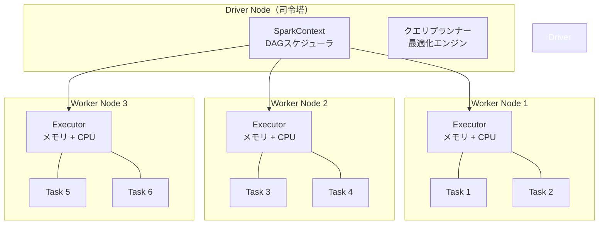
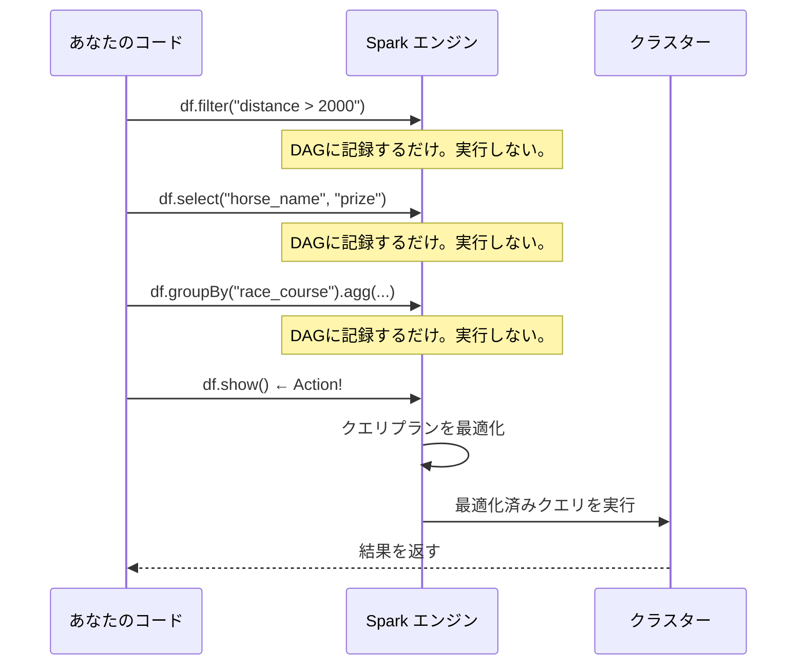
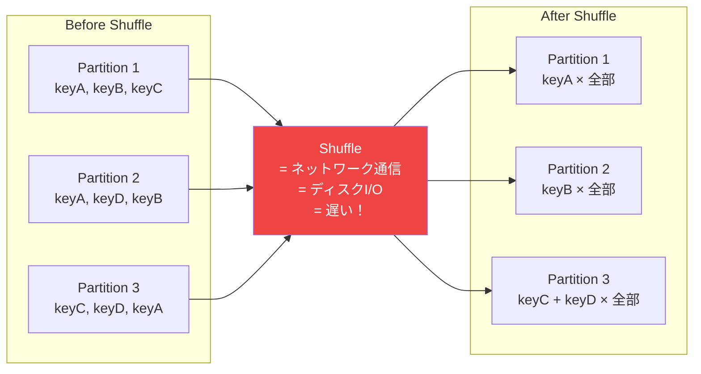
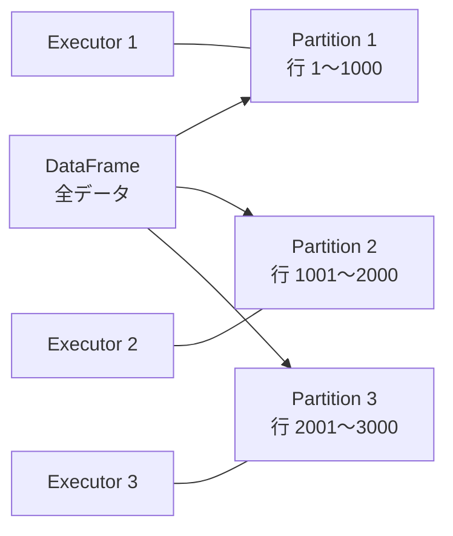
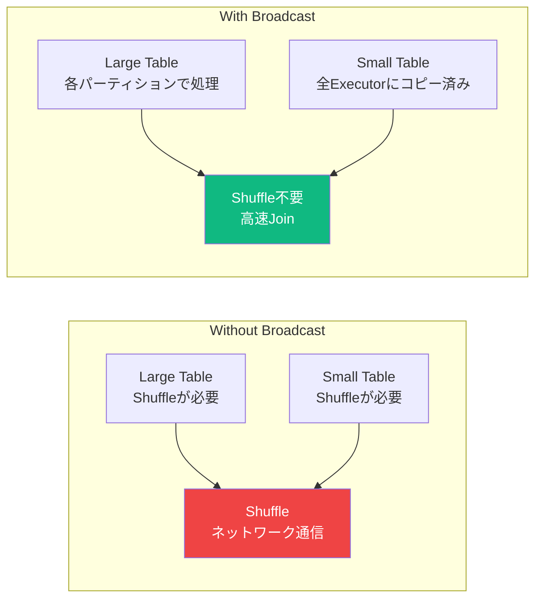
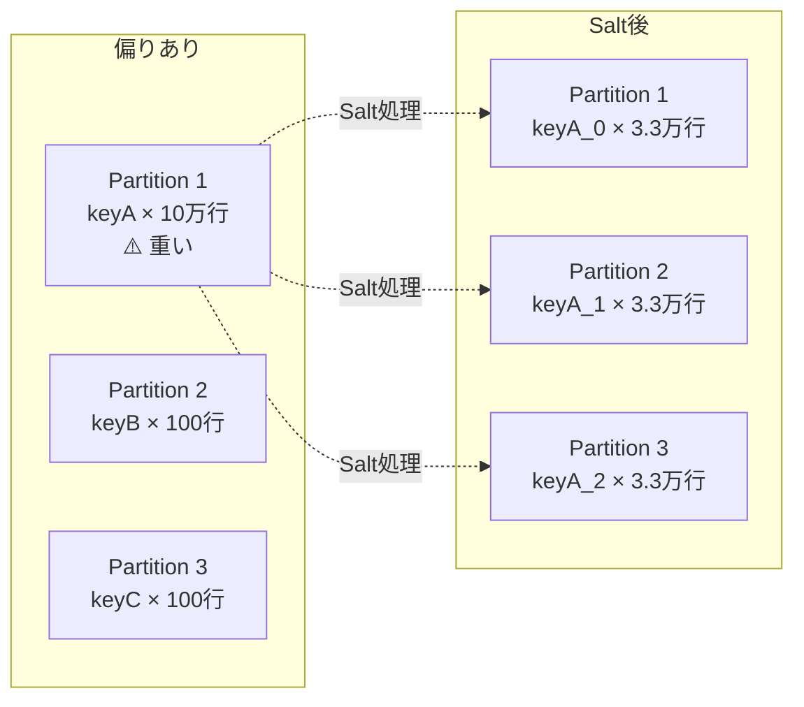

# Databricks アーキテクチャ

## Sparkの分散処理モデル



**ポイント**: Sparkは「分散処理」が前提。データをパーティションに分割し、複数のExecutorで並列処理する。

---

## RDD → DataFrame → Dataset の進化

| 世代 | 概要 | パフォーマンス | 現在の使用 |
|------|------|---------------|-----------|
| RDD | 低レベルAPI。型安全・柔軟だが手動最適化 | 遅い | 非推奨（特殊用途のみ）|
| **DataFrame** | 列指向の分散データ構造。Catalyst最適化 | **速い** | **メインで使う** |
| Dataset | 型安全なDataFrame（Scala/Java用）| 速い | Pythonでは使わない |

**結論**: PythonのDE業務では **DataFrame API** だけ使えればOK。

---

## 遅延評価（Lazy Evaluation）- 最重要概念



**なぜ遅延評価か？**
- Sparkがクエリ全体を見てから最適な実行計画（Catalyst Optimizer）を作るため
- 不要な計算をスキップできる（述語プッシュダウン、列プルーニング）
- 実行前に最適化するため結果的に速くなる

```python
# Transformations（変換）← 実行されない
df2 = df.filter(F.col("distance") > 2000)    # DAGに追加
df3 = df2.select("horse_name", "prize")       # DAGに追加
df4 = df3.orderBy("prize", ascending=False)   # DAGに追加

# Actions（実行）← ここで初めてSparkが動く
df4.show()        # ✓ Action
df4.count()       # ✓ Action
df4.collect()     # ✓ Action（全データをDriverに引き込む）
df4.write.save()  # ✓ Action
```

**Transformationsの種類**:
- Narrow Transform: `filter`, `select`, `withColumn` → シャッフル不要
- Wide Transform: `groupBy`, `join`, `orderBy` → シャッフル発生

---

## Shuffle（シャッフル）- パフォーマンスの鍵



**Shuffleが発生する操作**:
| 操作 | 理由 |
|------|------|
| `groupBy()` | 同じキーを同じノードに集める必要がある |
| `join()` | 同じキーを同じノードに集める必要がある |
| `orderBy()` | グローバルソートのため全データを並び替える |
| `distinct()` | 重複排除のため |
| `repartition()` | パーティション数を変更するため |

```python
# Shuffleの確認方法
df.explain()  # "Exchange" が出たらShuffleあり

# 実行計画の読み方
# == Physical Plan ==
# AdaptiveSparkPlan isFinalPlan=false
# +- HashAggregate(keys=[race_course#10], functions=[count(1)])  ← 集計
#    +- Exchange hashpartitioning(race_course#10, 200)           ← Shuffle！
#       +- HashAggregate(keys=[race_course#10], functions=[partial_count(1)])
#          +- FileScan parquet [race_course#10]                  ← ファイル読み込み
```

---

## パーティション

DataFrameはパーティション（小さいデータの塊）に分割されている。



```python
# パーティション数確認
df.rdd.getNumPartitions()

# パーティション調整
df.repartition(10)   # Shuffleあり・増減どちらも可
df.coalesce(1)       # Shuffleなし・削減のみ（1ファイル出力時に使う）

# Shuffleパーティション数の設定
# デフォルト200（大きすぎると小ファイルが大量発生）
spark.conf.set("spark.sql.shuffle.partitions", "50")
```

**パーティション数の目安**:
| データ量 | 推奨パーティション数 |
|---------|------------------|
| 〜1 GB | 8〜16 |
| 1〜10 GB | 50〜200 |
| 10 GB〜 | 200〜400 |

---

## Adaptive Query Execution（AQE）

Spark 3.x以降のデフォルト機能。**実行中に**クエリプランを動的に最適化。


AQEが自動でやること:
- **Skew Join の自動修正**: 偏ったパーティションを自動分割
- **Shuffle パーティション数の自動調整**: データ量に応じて削減
- **ブロードキャストJoinへの自動変換**: 小さいテーブルを自動でbroadcast

```python
# AQEの確認
spark.conf.get("spark.sql.adaptive.enabled")  # デフォルトtrue

# AQEを手動で制御（通常は不要）
spark.conf.set("spark.sql.adaptive.enabled", "true")
spark.conf.set("spark.sql.adaptive.skewJoin.enabled", "true")
```

---

## Broadcast Join

小さいテーブルを全ノードにコピーして、Shuffleを回避する。



```python
from pyspark.sql import functions as F

# 手動でブロードキャスト指定
result = large_races.join(
    F.broadcast(small_horse_master),  # ← これだけでShuffle回避
    on="horse_id",
    how="left"
)

# 自動ブロードキャストの閾値確認（デフォルト10MB）
spark.conf.get("spark.sql.autoBroadcastJoinThreshold")

# 閾値を50MBに拡大
spark.conf.set("spark.sql.autoBroadcastJoinThreshold", 50 * 1024 * 1024)
```

**目安**: テーブルが数百MB以下ならbroadcastを検討。マスタテーブル・コードテーブルに有効。

---

## Data Skew（データの偏り）



```python
# 偏りの確認
df.groupBy("race_course").count().orderBy("count", ascending=False).show()

# 対策1：AQEに任せる（Spark 3.x以降はほぼ自動）
spark.conf.set("spark.sql.adaptive.skewJoin.enabled", "true")

# 対策2：Salt（手動）
df_salted = df.withColumn(
    "salt", (F.rand() * 10).cast("int")
).withColumn(
    "salted_key", F.concat(F.col("skewed_key"), F.lit("_"), F.col("salt"))
)
```

---

## Window関数（重要！試験頻出）

```python
from pyspark.sql import Window
from pyspark.sql import functions as F

# ウィンドウ定義
window_spec = Window \
    .partitionBy("horse_name") \
    .orderBy("race_date")

# よく使うWindow関数
df.withColumn("row_num", F.row_number().over(window_spec))  # 連番
df.withColumn("rank", F.rank().over(window_spec))           # 順位（同順位あり）
df.withColumn("dense_rank", F.dense_rank().over(window_spec)) # 密な順位
df.withColumn("prev_prize", F.lag("prize", 1).over(window_spec)) # 1つ前の値
df.withColumn("next_prize", F.lead("prize", 1).over(window_spec)) # 1つ後の値

# 累計・移動平均
window_cum = Window.partitionBy("horse_name").orderBy("race_date").rowsBetween(
    Window.unboundedPreceding, Window.currentRow
)
df.withColumn("cumulative_prize", F.sum("prize").over(window_cum))  # 累計賞金

window_roll = Window.partitionBy("horse_name").orderBy("race_date").rowsBetween(-2, 0)
df.withColumn("moving_avg_3", F.avg("prize").over(window_roll))  # 3レース移動平均
```

---

## 試験で問われるポイント

**Q: TransformationsとActionsの違いは？**
> Transformationsは新しいDataFrameを返す操作で実行されない（遅延評価）。Actionsは実際に計算を実行し結果を返すか書き込む操作。

**Q: Broadcast Joinはどのような場合に有効か？**
> 一方のテーブルが小さい（デフォルト10MB以下、`spark.sql.autoBroadcastJoinThreshold`で変更可能）場合。Shuffleを回避できるため高速。

**Q: repartitionとcoalesceの違いは？**
> `repartition`はShuffleありで増減どちらも可能。`coalesce`はShuffleなしで削減のみ可能。

**Q: AQEが自動で行う最適化は？**
> Skew Joinの自動修正・Shuffleパーティション数の自動調整・ブロードキャストJoinへの自動変換。
