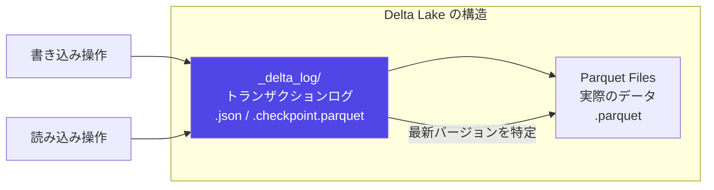
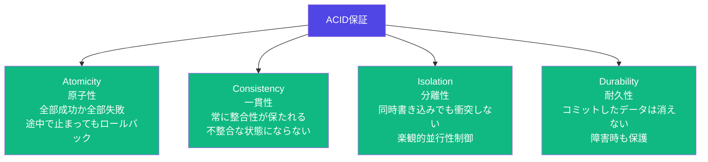
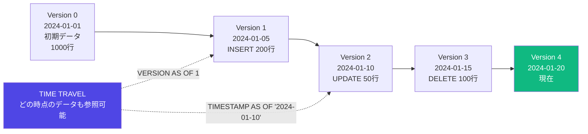
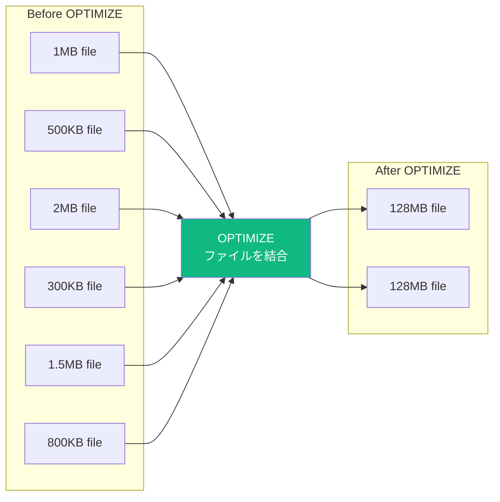
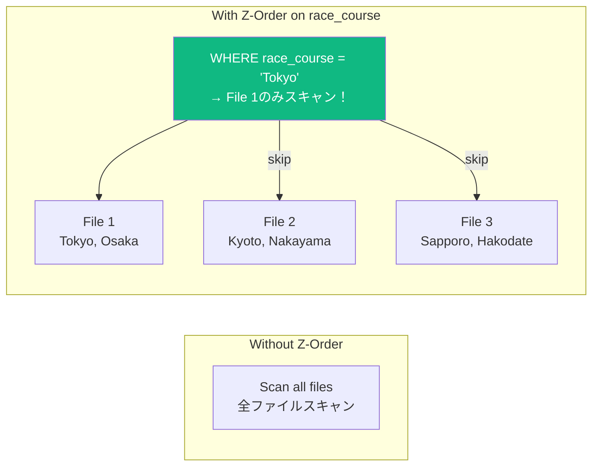
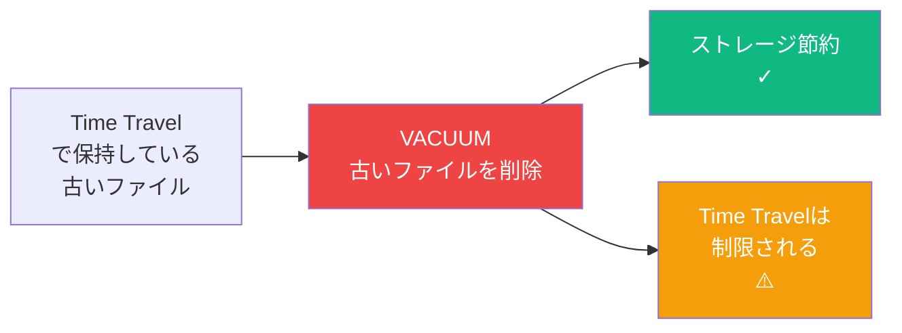

# Delta Lake

## Delta Lakeとは

Parquetファイルに **トランザクションログ** を追加したストレージ形式。
Databricksのデフォルトフォーマット。DEとして最重要概念の一つ。



---

## ACID特性（なぜDelta Lakeか）



| 特性 | Parquetだけだと | Delta Lakeなら |
|------|----------------|---------------|
| **Atomicity** | 途中で止まるとデータ破損 | ロールバック可能 |
| **Consistency** | 読み書きが競合する | 常に整合性が保たれる |
| **Isolation** | データ競合が起きる | 楽観的並行性制御 |
| **Durability** | 障害時にデータ消失 | コミット済みデータは保護 |

---

## 基本操作（CRUD）

### テーブル作成・書き込み

```python
# DataFrameからDeltaテーブルを作成
df.write \
  .format("delta") \
  .mode("overwrite") \
  .save("/path/to/delta_table")

# テーブルとして登録（Unity Catalog推奨）
df.write \
  .format("delta") \
  .mode("overwrite") \
  .saveAsTable("catalog.schema.table_name")

# 書き込みモードの使い分け
# overwrite  → テーブル全体を置き換える（注意！）
# append     → データを追加する
# ignore     → テーブルが存在する場合は何もしない
# errorIfExists → テーブルが存在する場合はエラー（デフォルト）
```

```sql
-- SQLでテーブル作成
CREATE TABLE IF NOT EXISTS races (
    race_id     STRING NOT NULL,
    race_date   DATE,
    race_course STRING,
    distance    INT,
    prize       BIGINT
)
USING DELTA
LOCATION '/path/to/delta_table'
PARTITIONED BY (race_date);  -- パーティション（オプション）
```

### 読み込み

```python
# パスから読む
df = spark.read.format("delta").load("/path/to/delta_table")

# テーブル名から読む（推奨）
df = spark.table("catalog.schema.table_name")

# SQLから
df = spark.sql("SELECT * FROM catalog.schema.table_name")
```

### 更新・削除・MERGE（重要！）

```sql
-- UPDATE（特定行の更新）
UPDATE races
SET prize = prize * 1.1
WHERE race_course = 'Tokyo';

-- DELETE（特定行の削除）
DELETE FROM races
WHERE race_date < '2020-01-01';

-- MERGE（Upsert = 存在すれば更新、なければ挿入）
MERGE INTO races AS target
USING new_races AS source
ON target.race_id = source.race_id
WHEN MATCHED THEN
  UPDATE SET *
WHEN NOT MATCHED THEN
  INSERT *
WHEN NOT MATCHED BY SOURCE THEN
  DELETE;  -- ソースにない行を削除（SCD Type 1の実装に使う）
```

```python
# Pythonからのmerge（DeltaTable API）
from delta.tables import DeltaTable

target = DeltaTable.forName(spark, "catalog.schema.races")
target.alias("target").merge(
    source=new_df.alias("source"),
    condition="target.race_id = source.race_id"
).whenMatchedUpdateAll() \
 .whenNotMatchedInsertAll() \
 .execute()
```

---

## Time Travel（タイムトラベル）



```python
# バージョン指定
df = spark.read \
    .format("delta") \
    .option("versionAsOf", 0) \
    .load("/path/to/delta_table")

# タイムスタンプ指定
df = spark.read \
    .format("delta") \
    .option("timestampAsOf", "2024-01-01") \
    .load("/path/to/delta_table")
```

```sql
-- SQLでのタイムトラベル
SELECT * FROM races VERSION AS OF 0;
SELECT * FROM races TIMESTAMP AS OF '2024-01-01';

-- 変更履歴の確認（試験頻出！）
DESCRIBE HISTORY races;
-- version, timestamp, operation, operationParameters が返る

-- テーブル詳細
DESCRIBE DETAIL races;
-- location, partitionColumns, numFiles, sizeInBytes が返る
```

**Time Travelの活用場面**:
- 誤ってDELETE/UPDATEした場合の復元
- 過去時点のデータで集計・比較
- データ品質監査

---

## OPTIMIZE と Z-Ordering

### スモールファイル問題



```sql
-- OPTIMIZEでファイルを結合（定期実行推奨）
OPTIMIZE races;

-- Z-Orderと組み合わせる（読み込み最適化）
OPTIMIZE races ZORDER BY (race_course, race_date);
```

### Z-Ordering（データスキッピング）



**Z-Orderの使い分け**:
| 適切な列 | 不適切な列 |
|---------|-----------|
| カーディナリティが高い（日付・ID）| ブール値（true/false のみ）|
| WHERE句で頻繁に使う | 滅多に使わない |
| 最大4列まで | 5列以上は効果が薄れる |

---

## VACUUM（ストレージクリーンアップ）



```sql
-- デフォルト7日（168時間）以前のファイルを削除
VACUUM races;

-- 保持期間を指定（本番では7日以上推奨）
VACUUM races RETAIN 168 HOURS;

-- 削除されるファイルを確認（dry run）
VACUUM races RETAIN 168 HOURS DRY RUN;
```

> **重要**: VACUUMすると、その時点より前のTime Travelができなくなる。
> 本番では保持期間を慎重に設定すること。デフォルト7日は基本変えない。

---

## スキーマ管理（Schema Enforcement / Evolution）

```python
# デフォルト：スキーマ強制（Schema Enforcement）
# スキーマが合わない場合はエラーになる
df.write.format("delta").mode("append").save("/path/")  # スキーマ不一致 → エラー

# スキーマ進化を許可（Schema Evolution）
df.write \
  .format("delta") \
  .option("mergeSchema", "true") \
  .mode("append") \
  .save("/path/")

# スキーマ上書き（危険！使用注意）
df.write \
  .format("delta") \
  .option("overwriteSchema", "true") \
  .mode("overwrite") \
  .save("/path/")
```

**Schema Enforcementとは**:
- 既存のスキーマと一致しないデータを書き込もうとするとエラー
- データ品質を保護する重要な機能
- `mergeSchema=true` で新しい列の追加は許可できる

---

## Liquid Clustering（新機能 - Z-Orderの後継）

```sql
-- Liquid Clusteringを有効にしたテーブル作成
CREATE TABLE races
CLUSTER BY (race_course, race_date)
AS SELECT * FROM source_table;

-- 既存テーブルに適用
ALTER TABLE races CLUSTER BY (race_course, race_date);

-- クラスタリングの実行（OPTIMIZE と同じコマンド）
OPTIMIZE races;
```

| 比較 | Z-Order | Liquid Clustering |
|------|---------|------------------|
| 対象 | 既存テーブル向け | 新規テーブル推奨 |
| 変更 | OPTIMIZEのたびに指定 | 一度設定すれば自動 |
| 列数制限 | 最大4列 | 制限なし |
| パーティション | 別途設定 | 不要（代替する）|

---

## 試験で問われるポイント

**Q: Delta Lakeのトランザクションログはどこに保存されるか？**
> `_delta_log` ディレクトリにJSONファイルとして保存される（チェックポイントは.parquet）。

**Q: Time Travelでバージョン0を参照するコードは？**
> `.option("versionAsOf", 0)` を使う。SQLでは `VERSION AS OF 0`。

**Q: VACUUMの注意点は？**
> VACUUMした時点より前のTime Travelができなくなる。デフォルト保持期間は7日（168時間）。

**Q: Z-Orderに適した列は？**
> カーディナリティが高くWHERE句で頻繁に使う列。最大4列まで。

**Q: MERGE文はどのような処理に使うか？**
> Upsert（存在すれば更新・なければ挿入）。CDC（Change Data Capture）の取り込みに使う。

**Q: Schema EnforcementとSchema Evolutionの違いは？**
> Enforcementはスキーマ不一致をエラーにする（デフォルト）。Evolutionは`mergeSchema=true`で新列追加を許可する。
