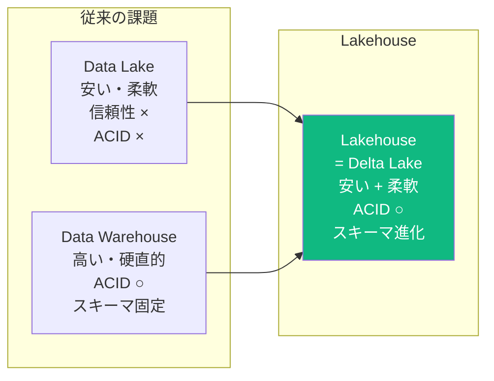
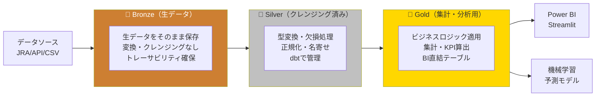
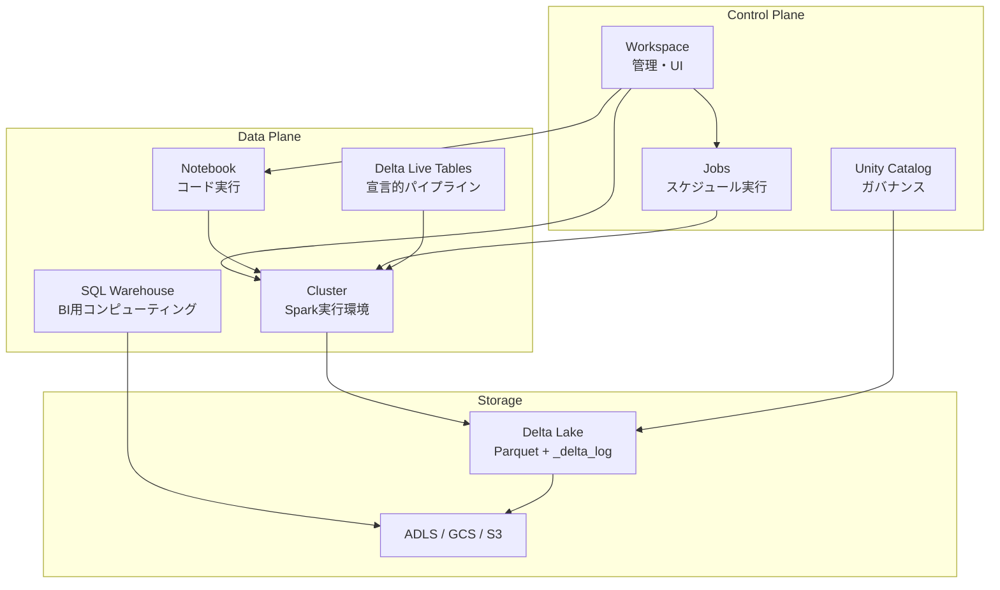
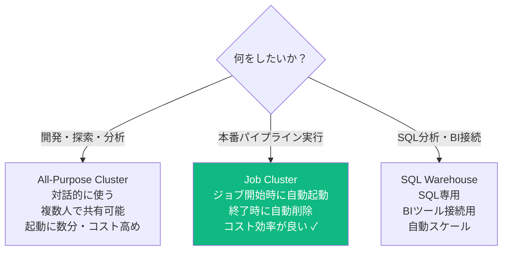
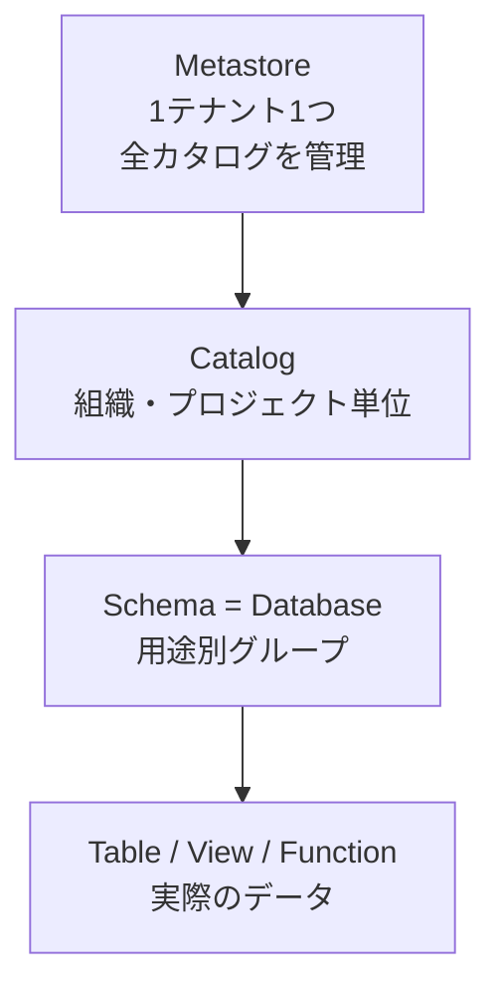
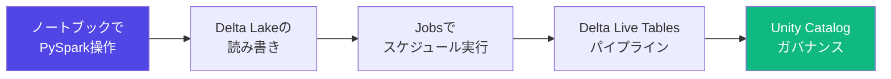

# Databricks 概要

## Databricksとは

ApacheSparkをベースにした**統合データ分析プラットフォーム**。
データエンジニアリング・データサイエンス・機械学習を1つのプラットフォームで実現。

**クラウド対応**: AWS / Azure / GCP すべてで動く。資格はクラウド問わず通用。

---

## Lakehouserアーキテクチャ（Databricksの核心）



**なぜLakehouseか:**
- Data Lakeだけ → ACID保証なし。障害時にデータ破損
- DWHだけ → 高コスト。非構造化データを扱いにくい
- Lakehouse → 両方の良いとこ取り。Delta Lakeが実現

---

## Medallion Architecture（データ階層設計）

DEとして最重要概念。データを段階的に品質向上させる設計パターン。



| レイヤー | 役割 | 処理内容 | ツール |
|---------|------|---------|------|
| Bronze | 生データ保管 | そのままIngestion | Auto Loader・ADF |
| Silver | 信頼性向上 | クレンジング・型変換・正規化 | PySpark・dbt |
| Gold | 分析用 | 集計・KPI・ビジネスロジック | dbt・Spark SQL |

---

## 主要コンポーネント全体図



| コンポーネント | 役割 |
|--------------|------|
| **Workspace** | チームでノートブック・ジョブを管理する場所 |
| **Cluster** | Sparkを実行するコンピューティングリソース |
| **Notebook** | コードを書いて実行（Python・SQL・Scala対応）|
| **Delta Lake** | データストレージ形式（ACIDトランザクション対応）|
| **Delta Live Tables** | パイプラインを宣言的に定義する仕組み |
| **Unity Catalog** | データガバナンス・アクセス管理 |
| **MLflow** | 機械学習実験管理 |
| **Jobs** | ノートブックをスケジュール実行する仕組み |

---

## クラスターの種類と使い分け



**コスト最適化の鉄則**: 本番パイプラインは必ず **Job Cluster** を使う。All-Purpose Clusterは開発時のみ。

---

## Databricksのデータ階層（Unity Catalog）



```sql
-- Unity Catalogを使った参照
SELECT * FROM catalog_name.schema_name.table_name

-- 現在のコンテキスト確認
SELECT current_catalog(), current_schema()

-- 権限管理
GRANT SELECT ON TABLE main.bronze.races TO user@example.com;
SHOW GRANTS ON TABLE main.bronze.races;
```

---

## ノートブックの基本

```python
# マジックコマンド（%で始まる）
%python   # Pythonで書く（デフォルト）
%sql      # SQLで書く
%scala    # Scalaで書く
%md       # Markdownで書く
%sh       # シェルコマンド
%fs       # DBFS（Databricksファイルシステム）操作

# DBFSの確認
%fs ls /

# ファイルの内容確認（先頭のみ）
%fs head /path/to/file
```

```python
# セル間のデータ受け渡し（Python → SQL）
df = spark.sql("SELECT * FROM races")
df.createOrReplaceTempView("races_view")

# 別のSQLセルで参照可能
# %sql
# SELECT * FROM races_view WHERE distance > 2000
```

---

## DBFS（Databricks File System）

```python
# ファイル一覧
dbutils.fs.ls("/")
dbutils.fs.ls("dbfs:/mnt/")

# ファイルコピー
dbutils.fs.cp("/source/path", "/dest/path")

# ファイル削除
dbutils.fs.rm("/path/to/file", recurse=True)

# ファイル内容確認
dbutils.fs.head("/path/to/file", maxBytes=10000)

# マウント（ADLSなどを接続）
dbutils.fs.mount(
    source="abfss://container@storage.dfs.core.windows.net/",
    mount_point="/mnt/datalake",
    extra_configs={...}
)
```

---

## Databricksで学習する順番



---

## よく出る試験ポイント

**Q: LakehouseとData Warehouseの違いは？**
> LakehouseはData Lakeの低コスト・柔軟性とData WarehouseのACID・パフォーマンスを組み合わせたもの。Delta Lakeで実現。

**Q: Medallion Architectureの各レイヤーの役割は？**
> Bronze=生データそのまま, Silver=クレンジング済み, Gold=集計・分析用

**Q: All-Purpose ClusterとJob Clusterの違いは？**
> All-Purposeは対話的開発用（共有可能・コスト高）。Job Clusterは本番実行用（ジョブ終了時に自動削除・コスト効率良い）。

---

## 次のステップ

- [アーキテクチャ詳細](architecture.md) - Sparkの仕組みを理解する
- [Delta Lake](delta_lake.md) - DEの核心を深める
- [パフォーマンス最適化](performance.md) - 実務レベルへ
- [Databricks Associate 試験対策](../certifications/databricks_associate.md) - 試験に向けて
