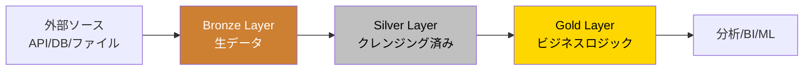
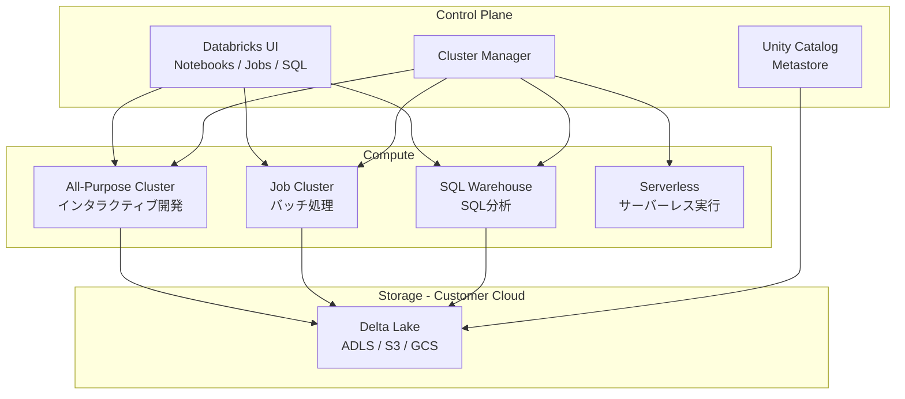

# Lakehouse アーキテクチャ

## Lakehouse とは

```
Data Lake（安い・柔軟・生データ）
  ＋
Data Warehouse（速い・信頼性高い・分析向け）
  ↓
Lakehouse: 両方のいいとこ取り
```

**Databricksが提唱**した概念。Delta Lakeがその技術的基盤。

---

## メダリオンアーキテクチャ

Databricksが推奨するデータ整理のパターン。最重要。



### Bronze（生データ層）

```python
# そのままLandingする（変換しない）
# スキーマ: 生データ + メタデータ列を追加するだけ

df_bronze = (
    spark.read
    .format("json")
    .load("/landing/races/2024/")
    .withColumn("_ingested_at", F.current_timestamp())
    .withColumn("_source_file", F.input_file_name())
)

df_bronze.write \
    .format("delta") \
    .mode("append") \
    .saveAsTable("catalog.bronze.races_raw")
```

**Bronzeのポイント**
- データを加工しない（生のまま保存）
- スキーマはゆるく（inferSchema or schema_of_json）
- 再処理可能にする（Landingデータは消さない）

### Silver（クレンジング層）

```python
# Bronze → Silver: クレンジング・型変換・デduplication

df_silver = (
    spark.table("catalog.bronze.races_raw")
    # 重複排除（最新のもの1件）
    .withColumn("rn", F.row_number().over(
        Window.partitionBy("race_id").orderBy(F.col("_ingested_at").desc())
    ))
    .filter(F.col("rn") == 1)
    .drop("rn")
    # 型変換
    .withColumn("race_date", F.to_date(F.col("race_date"), "yyyy-MM-dd"))
    .withColumn("prize", F.col("prize").cast("long"))
    # NULL除去
    .filter(F.col("race_id").isNotNull())
    # 不要列削除
    .drop("_source_file")
)

df_silver.write \
    .format("delta") \
    .mode("overwrite") \
    .option("overwriteSchema", "true") \
    .saveAsTable("catalog.silver.races_cleaned")
```

**Silverのポイント**
- 1ソース = 1テーブルが基本
- 型を正しく変換する
- 重複を除去する
- NULL・異常値を処理する

### Gold（ビジネス層）

```python
# Silver → Gold: 複数テーブルを結合・集計

df_gold = spark.sql("""
    SELECT
        r.race_course,
        r.race_year,
        COUNT(*)          AS race_count,
        AVG(r.prize)      AS avg_prize,
        COUNT(DISTINCT h.trainer_name) AS trainer_count
    FROM catalog.silver.races_cleaned r
    JOIN catalog.silver.horses_master h USING (horse_id)
    GROUP BY r.race_course, r.race_year
""")

df_gold.write \
    .format("delta") \
    .mode("overwrite") \
    .saveAsTable("catalog.gold.race_stats_by_course")
```

**Goldのポイント**
- ビジネスロジックを持つ
- BIツールやMLが直接使う
- dbtで管理するのがベストプラクティス

---

## Databricks の主要コンポーネント



---

## クラスタータイプ

| タイプ | 用途 | 特徴 |
|--------|------|------|
| All-Purpose | ノートブック開発・探索 | 手動起動・停止、共用可能 |
| Job Cluster | 本番パイプライン実行 | ジョブ実行時に起動→終了 |
| SQL Warehouse | Databricks SQL・BI接続 | SQL特化、自動スケール |
| Serverless | コスト最適化 | 起動速い・管理不要 |

```python
# クラスター設定例（Job Cluster）
cluster_config = {
    "spark_version": "14.3.x-scala2.12",
    "node_type_id": "Standard_DS3_v2",
    "num_workers": 4,
    "autoscale": {
        "min_workers": 2,
        "max_workers": 8
    },
    "spark_conf": {
        "spark.sql.adaptive.enabled": "true",
        "spark.sql.shuffle.partitions": "auto"
    }
}
```

---

## Databricks Workflows（パイプライン管理）

AirflowのDatabricks版。タスクの依存関係・スケジュール管理。

```python
# Databricks SDK でジョブを作成（参考）
from databricks.sdk import WorkspaceClient

w = WorkspaceClient()

job = w.jobs.create(
    name="keiba_daily_pipeline",
    tasks=[
        {
            "task_key": "bronze_ingestion",
            "notebook_task": {
                "notebook_path": "/Repos/keiba/01_bronze_ingestion"
            }
        },
        {
            "task_key": "silver_transform",
            "depends_on": [{"task_key": "bronze_ingestion"}],
            "notebook_task": {
                "notebook_path": "/Repos/keiba/02_silver_transform"
            }
        },
        {
            "task_key": "gold_aggregate",
            "depends_on": [{"task_key": "silver_transform"}],
            "dbt_task": {
                "project_directory": "/Repos/keiba/dbt",
                "commands": ["dbt run --select gold.*"]
            }
        }
    ],
    schedule={
        "quartz_cron_expression": "0 0 6 * * ?",  # 毎朝6時
        "timezone_id": "Asia/Tokyo"
    }
)
```

---

## Photon Engine

DatabricksのC++製クエリエンジン。SQL/DataFrameを高速化。

```
通常のSpark: JVM上でJavaコード実行
Photon:      C++でネイティブ実行 → 最大8倍高速
```

**Photonが効く処理**
- SQL分析クエリ（GROUP BY, JOIN, AGG）
- Delta Lake の読み書き
- 大量データのスキャン

**設定確認**
```python
spark.conf.get("spark.databricks.photon.enabled")  # true
```

---

## Databricks vs Synapse vs BigQuery

| 比較項目 | Databricks | Azure Synapse | BigQuery |
|----------|-----------|---------------|----------|
| 得意領域 | ML + ETL | DWH + ETL | DWH + SQL |
| 課金単位 | DBU（時間）| DWU / vCore | スキャン量 |
| Delta Lake | ネイティブ | 対応 | 非対応 |
| Spark | ネイティブ | 対応 | 非対応 |
| マルチクラウド | ○ | Azure専用 | GCP専用 |
| 学習コスト | 中〜高 | 中 | 低（SQLのみなら）|
