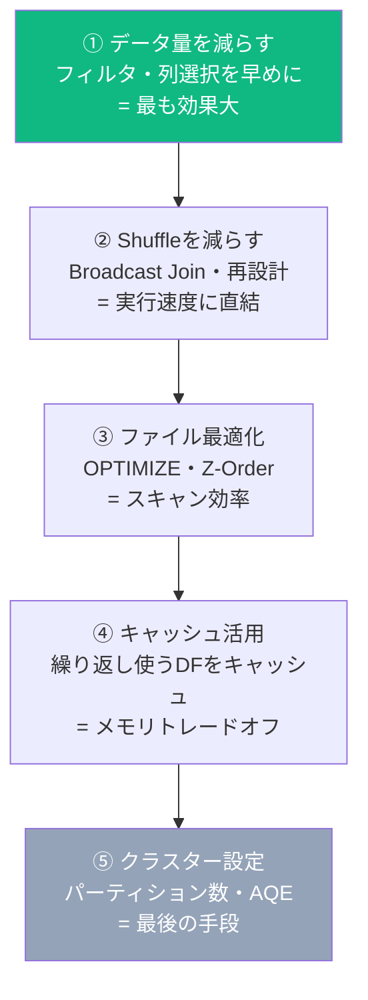
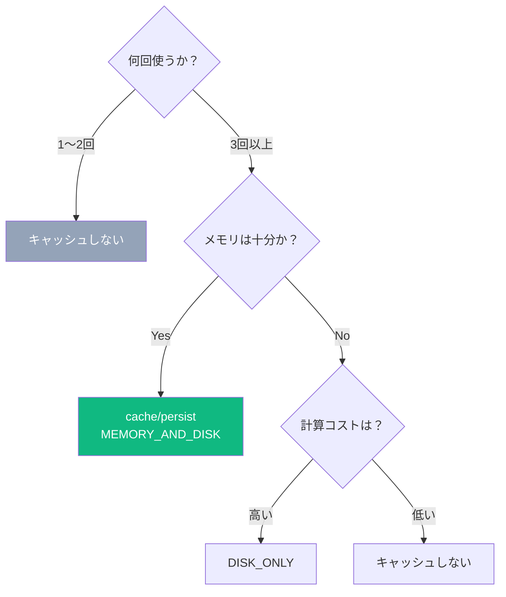
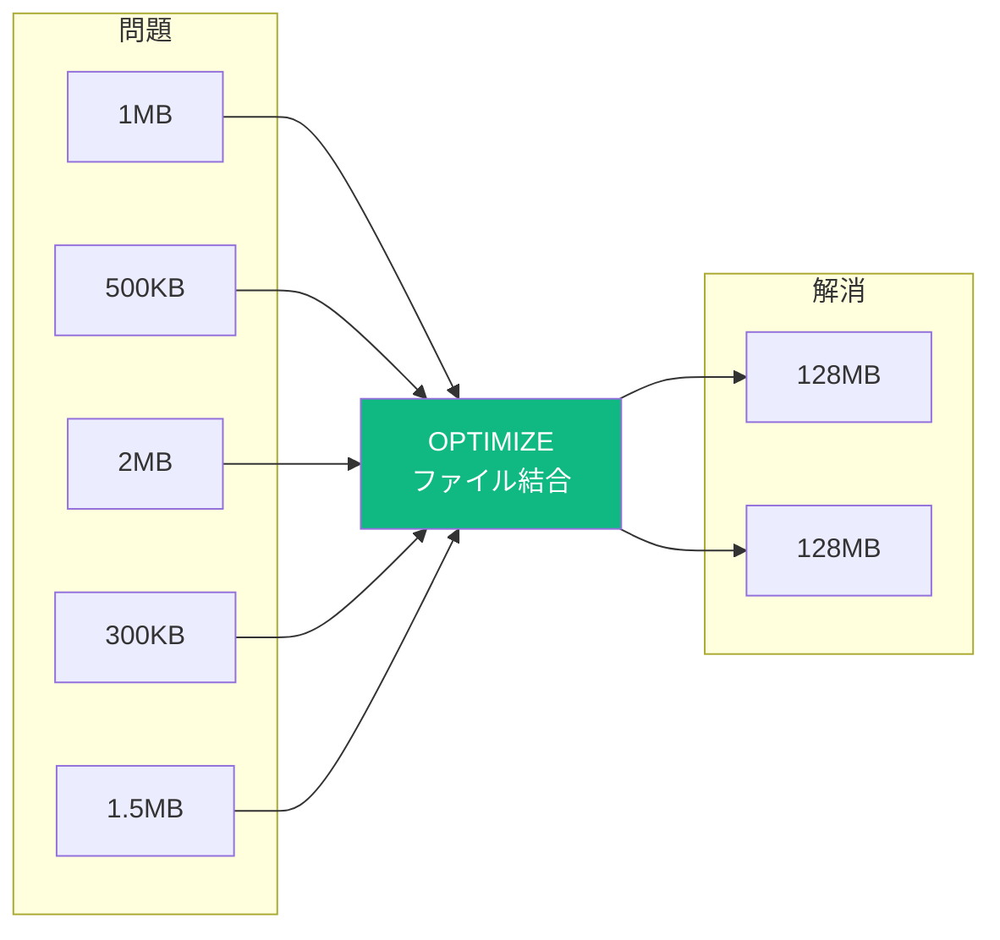
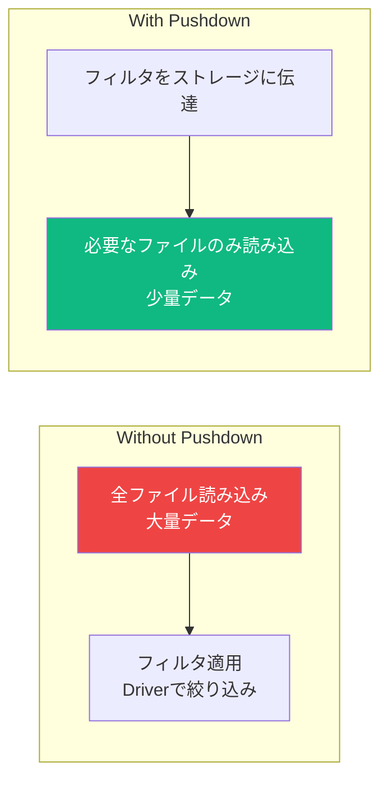

# パフォーマンス最適化

## 基本原則（計測 → 特定 → 改善）


---

## 最適化の優先順位



---

## Spark UI の見方

```python
# 実行計画を確認
df.explain()        # 簡易版（Optimized Logical Plan）
df.explain(True)    # 詳細版（Parsed / Analyzed / Optimized / Physical）
df.explain("formatted")  # 読みやすい形式
```

**Physical Planのキーワード**:

| キーワード | 意味 | 対策 |
|----------|------|------|
| `Exchange` | Shuffle発生 | Broadcast Joinや設計見直し |
| `Sort` | ソート発生 | 本当に必要か確認 |
| `BroadcastHashJoin` | Broadcast Join済み ✓ | 対策不要 |
| `SortMergeJoin` | Shuffleを伴うJoin | Broadcastへの変更を検討 |
| `FileScan` の行数が多い | フルスキャン | フィルタ・Z-Order確認 |
| `SkewedJoin` | データ偏り | AQEかSalt |

---

## キャッシュ戦略



```python
from pyspark import StorageLevel

# 基本（メモリ+ディスク）
df.cache()   # = df.persist(StorageLevel.MEMORY_AND_DISK)

# ストレージレベルを指定
df.persist(StorageLevel.MEMORY_ONLY)       # メモリのみ（溢れたら再計算）
df.persist(StorageLevel.DISK_ONLY)         # ディスクのみ（遅いが確実）
df.persist(StorageLevel.MEMORY_AND_DISK)   # 推奨（溢れたらディスクに）
df.persist(StorageLevel.MEMORY_ONLY_2)     # レプリカ2つ（耐障害性）

# 最初のActionで実際にキャッシュされる
df.count()  # ← ここでキャッシュ実行

# 不要になったら解放（メモリ節約）
df.unpersist()
```

**キャッシュすべきとき**:
- 同じDataFrameを3回以上使う
- 計算コストが高い中間結果（大規模Join後）
- インタラクティブな分析で同じデータを繰り返し参照

**キャッシュしないほうがよい**:
- 1〜2回しか使わない
- ストリーミング処理
- データサイズがメモリの70%を超える場合

---

## Broadcast Join の活用

```python
from pyspark.sql import functions as F

# ❌ 通常のJoin（Shuffleあり・大規模テーブル同士では遅い）
result = large_races.join(horse_master, on="horse_id", how="left")

# ✓ Broadcast Join（Shuffleなし・小テーブルを全Executorにコピー）
result = large_races.join(
    F.broadcast(horse_master),  # 小テーブルをbroadcast
    on="horse_id",
    how="left"
)

# 自動broadcast閾値の確認・変更
print(spark.conf.get("spark.sql.autoBroadcastJoinThreshold"))  # デフォルト: 10MB
spark.conf.set("spark.sql.autoBroadcastJoinThreshold", 50 * 1024 * 1024)  # 50MBに拡大

# broadcastを無効にする（デバッグ用）
spark.conf.set("spark.sql.autoBroadcastJoinThreshold", "-1")
```

---

## パーティション最適化

```python
# Shuffleパーティション数の設定（デフォルト200）
spark.conf.set("spark.sql.shuffle.partitions", "50")  # データ量に応じて調整

# データ量別の目安
# 〜1GB   → 8〜16
# 1〜10GB → 50〜200
# 10GB〜  → 200〜400

# 書き込み前にパーティション数を調整
df.repartition(10).write.format("delta").save("/path/")  # Shuffleあり・均等分割
df.coalesce(1).write.format("delta").save("/path/")      # Shuffleなし・1ファイルに集約

# パーティション列でrepartition（同じキーを同じパーティションに）
df.repartition(10, "race_course").write...

# パーティション分割キーを確認
df.rdd.getNumPartitions()
```

---

## スモールファイル問題と OPTIMIZE



```sql
-- OPTIMIZEでファイルを結合
OPTIMIZE races;

-- Z-Orderと組み合わせる（読み込み最適化）
OPTIMIZE races ZORDER BY (race_date, race_course);
```

```sql
-- 自動最適化（テーブルプロパティで設定）
ALTER TABLE races SET TBLPROPERTIES (
    'delta.autoOptimize.optimizeWrite' = 'true',  -- 書き込み時に自動最適化
    'delta.autoOptimize.autoCompact' = 'true'     -- 定期的に自動結合
);
```

---

## Predicate Pushdown（述語プッシュダウン）



```python
# DeltaはデフォルトでPredicate Pushdownを適用
df = spark.read.format("delta").load("/path/") \
    .filter(F.col("race_date") >= "2024-01-01")  # ← 読み込み時点でフィルタ

# explainで確認（PushedFilters が表示されたらOK）
df.explain()
# PushedFilters: [GreaterThanOrEqual(race_date,2024-01-01)]  ← ✓

# 列の削除も早めに（Column Pruning）
df.select("horse_name", "prize")  # 必要な列だけ早めに選択
```

---

## よくあるアンチパターン

```python
# ❌ collect()で全データをDriverに引き込む（メモリ不足の原因）
all_data = df.collect()   # 100万行をDriverのメモリに載せる
# ✓ 必要な件数だけ取る
sample = df.limit(1000).collect()

# ❌ ループ内でDataFrame操作（毎回新しいDFが作られる→遅い）
for i in range(100):
    df = df.withColumn(f"col_{i}", F.lit(i))
# ✓ まとめてselect/SQL/map処理

# ❌ UDFを多用する（PythonとJVM間のシリアライズが遅い）
@F.udf(StringType())
def my_func(x): return x.upper()
df.withColumn("upper", my_func(F.col("name")))
# ✓ 組み込み関数を使う
df.withColumn("upper", F.upper(F.col("name")))

# ❌ count()を何度も呼ぶ
count1 = df.count()  # ← Actionが実行される
# ✓ 1度だけcacheして再利用
df.cache()
count1 = df.count()  # ← ここでキャッシュ
# その後の処理はキャッシュから読む

# ❌ orderBy()のしすぎ（グローバルSortはShuffleが発生）
df.groupBy("x").count().orderBy("count")  # ← countの後にSort
# ✓ 本当に必要な場合だけ
```

---

## Spark UI で確認するメトリクス

| メトリクス | 意味 | 問題の場合の対策 |
|----------|------|---------------|
| Task Duration（Max/Min の差） | データ偏り（Skew） | Salt・AQEで修正 |
| Shuffle Read/Write Size | Shuffle量 | Broadcast Join・設計見直し |
| GC Time | ガベージコレクション時間 | メモリ増加・キャッシュ削減 |
| Input Size vs Output Size | データ削減率 | フィルタ・列選択を早める |
| Number of Tasks | パーティション数 | shuffle.partitionsを調整 |

---

## 試験で問われるポイント

**Q: `spark.sql.shuffle.partitions` のデフォルト値は？**
> 200

**Q: Broadcast Joinが有効な条件は？**
> 一方のテーブルが `spark.sql.autoBroadcastJoinThreshold`（デフォルト10MB）以下の場合。

**Q: スモールファイル問題への対処法は？**
> `OPTIMIZE` コマンドでファイルを結合する。`delta.autoOptimize.optimizeWrite`を設定すると書き込み時に自動最適化。

**Q: `repartition(1)` と `coalesce(1)` の違いは？**
> `repartition(1)` はShuffleあり（データを均等に1パーティションへ）。`coalesce(1)` はShuffleなし（既存パーティションを合併するだけ）。出力を1ファイルにしたいなら`coalesce(1)`が効率的。

**Q: Predicate Pushdownとは何か？**
> フィルタ条件をデータソース（ストレージ）レベルで適用し、読み込むデータ量を削減する最適化。DeltaやParquetはファイルレベルのスタットを持つため、対象外ファイルをスキップできる。
