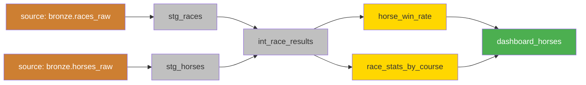

# dbt 応用

基礎のモデル・テスト・ドキュメントに加えて、現場で使う応用機能。

---

## Macros（マクロ）

Jinjaテンプレートで再利用可能なSQLコードを定義する。

```sql
-- macros/date_spine.sql


    CASE
        WHEN MONTH({{ date_col }}) >= 4
        THEN YEAR({{ date_col }})
        ELSE YEAR({{ date_col }}) - 1
    END

```

```sql
-- models/marts/races_by_fiscal_year.sql

SELECT
    {{ get_fiscal_year('race_date') }} AS fiscal_year,
    race_course,
    COUNT(*) AS race_count,
    SUM(prize) AS total_prize
FROM {{ ref('stg_races') }}
GROUP BY 1, 2
```

### マクロで条件分岐

```sql
-- macros/safe_divide.sql


    {{ numerator }} / NULLIF({{ denominator }}, 0)

```

```sql
-- 使用例
SELECT {{ safe_divide('wins', 'total_races') }} AS win_rate
FROM {{ ref('horse_stats') }}
```

---

## Snapshots（スナップショット）

**SCD（Slowly Changing Dimension）タイプ2**を自動実装。
マスタデータの変更履歴を保持する。

```sql
-- snapshots/horse_master_snapshot.sql



{{
    config(
        target_schema='snapshots',
        unique_key='horse_id',
        strategy='timestamp',      -- 更新日時で変更検知
        updated_at='updated_at',   -- 更新日時カラム
    )
}}

SELECT
    horse_id,
    horse_name,
    trainer_name,
    owner_name,
    updated_at
FROM {{ source('raw', 'horse_master') }}


```

```bash
# スナップショット実行
dbt snapshot
```

**スナップショット実行後のテーブルイメージ**

| horse_id | horse_name | trainer_name | dbt_valid_from | dbt_valid_to |
|---------|-----------|-------------|---------------|-------------|
| H001 | イクイノックス | 木村哲也 | 2022-01-01 | 2023-06-01 |
| H001 | イクイノックス | 木村哲也（新） | 2023-06-01 | NULL ← 現在 |

---

## Seeds（シード）

CSVファイルをdbtで管理してテーブルに変換する。
マスタデータや定数テーブルに使う。

```
seeds/
├── race_courses.csv
└── distance_categories.csv
```

```csv
# seeds/race_courses.csv
course_code,course_name,location,track_type
01,札幌,北海道,芝・ダート
02,函館,北海道,芝・ダート
03,福島,東北,芝・ダート
10,東京,関東,芝・ダート
```

```bash
# シードをDBにロード
dbt seed
dbt seed --select race_courses  # 特定のみ
```

```sql
-- モデルからシードを参照
SELECT r.race_id, rc.course_name
FROM {{ ref('stg_races') }} r
JOIN {{ ref('race_courses') }} rc ON r.course_code = rc.course_code
```

---

## Sources（ソース定義）

生データ（Bronzeなど）を `source()` で参照する定義。
テスト・ドキュメントも書ける。

```yaml
# models/staging/_sources.yml

version: 2

sources:
  - name: bronze                          # ソース名
    database: my_catalog                  # カタログ名
    schema: bronze                        # スキーマ名
    tables:
      - name: races_raw
        description: "JRAから取得した生レースデータ"
        freshness:                        # データ鮮度チェック
          warn_after: {count: 1, period: day}
          error_after: {count: 3, period: day}
        loaded_at_field: _ingested_at
        columns:
          - name: race_id
            tests:
              - not_null
              - unique
          - name: race_date
            tests:
              - not_null
```

```bash
# ソースの鮮度チェック
dbt source freshness
```

---

## Packages（パッケージ）

dbt Hubにあるオープンソースのマクロ集を使う。

```yaml
# packages.yml

packages:
  - package: dbt-labs/dbt_utils
    version: 1.1.1
  - package: calogica/dbt_date
    version: 0.10.1
```

```bash
# インストール
dbt deps
```

```sql
-- dbt_utils の便利マクロ
-- 複数テーブルをUNION ALLする
{{ dbt_utils.union_relations(
    relations=[
        ref('races_2022'),
        ref('races_2023'),
        ref('races_2024')
    ]
) }}

-- surrogate key（複数列からハッシュキー生成）
{{ dbt_utils.generate_surrogate_key(['race_id', 'horse_id']) }} AS result_key
```

---

## Exposures（エクスポージャー）

dbtのDAGにダウンストリーム（BIツール等）を記録する。

```yaml
# models/_exposures.yml

version: 2

exposures:
  - name: keiba_dashboard
    type: dashboard
    maturity: high
    url: https://tableau.company.com/views/Keiba
    description: "競馬データ分析ダッシュボード"
    owner:
      name: Jordan
      email: jordan@company.com
    depends_on:
      - ref('race_stats_by_course')
      - ref('horse_win_rate')
```

---

## テストのカスタマイズ

### カスタムテスト

```sql
-- tests/assert_prize_positive.sql
-- このクエリが0行を返せばテスト成功

SELECT *
FROM {{ ref('stg_races') }}
WHERE prize < 0
```

```yaml
# models/staging/_stg_races.yml
models:
  - name: stg_races
    tests:
      - assert_prize_positive  # カスタムテスト
```

### dbt_utils のテスト

```yaml
columns:
  - name: finish_position
    tests:
      - dbt_utils.accepted_range:
          min_value: 1
          max_value: 18
  - name: race_date
    tests:
      - dbt_utils.not_null_proportion:
          at_least: 0.95  # 95%以上がNULLでないこと
```

---

## 環境（dev/prod）の分離

```yaml
# profiles.yml

my_project:
  target: dev
  outputs:
    dev:
      type: databricks
      host: "{{ env_var('DATABRICKS_HOST') }}"
      http_path: "{{ env_var('DATABRICKS_HTTP_PATH') }}"
      token: "{{ env_var('DATABRICKS_TOKEN') }}"
      schema: "dev_{{ env_var('DBT_USER', 'anonymous') }}"  # ユーザーごとのスキーマ
      threads: 4

    prod:
      type: databricks
      host: "{{ env_var('DATABRICKS_HOST_PROD') }}"
      http_path: "{{ env_var('DATABRICKS_HTTP_PATH_PROD') }}"
      token: "{{ env_var('DATABRICKS_TOKEN_PROD') }}"
      schema: gold
      threads: 8
```

```bash
# 本番環境で実行
dbt run --target prod
```

---

## dbt全体のDAGイメージ


