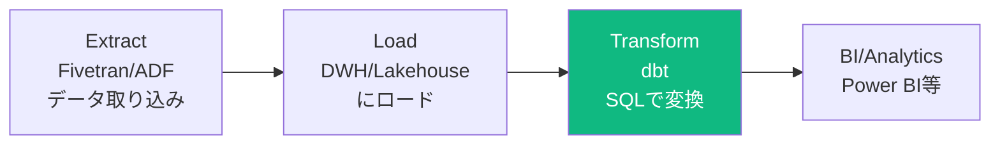
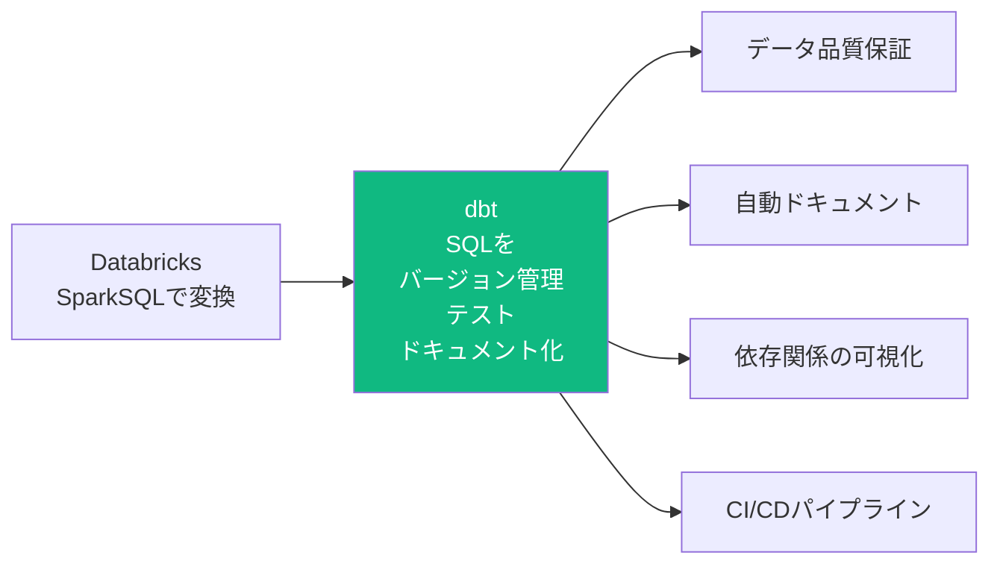
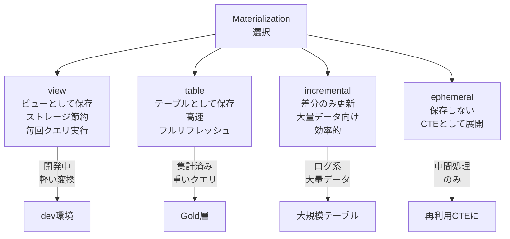
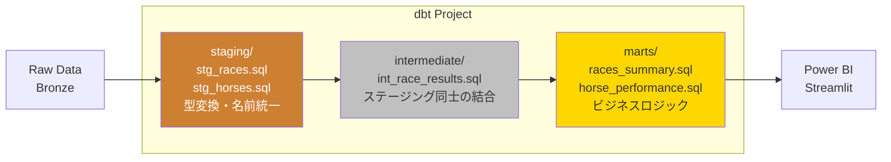
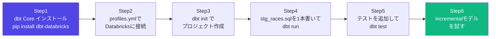

# dbt（data build tool）

## dbtとは

SQLでデータ変換パイプラインを書くツール。「データウェアハウス内の変換」に特化。



**dbtがやること**: Transform（変換）のみ。Extract・Loadは別ツールが担う。

---

## なぜdbtか（日本市場での立ち位置）



**dbtが解決する問題**:
- SQLが散在して管理できない → Gitでバージョン管理
- データ品質チェックが手作業 → `dbt test` で自動テスト
- どのテーブルがどこから来たかわからない → 自動でDAGドキュメント生成
- SQLに変更を入れると影響範囲がわからない → lineageが見える

---

## dbtの核心概念

### モデル（Model）

dbtの基本単位。**1つのSQLファイル = 1つのテーブル or ビュー**。

```sql
-- models/marts/races_summary.sql

WITH source AS (
    SELECT * FROM {{ ref('stg_races') }}   -- ← 他のモデルを参照（依存関係を宣言）
),

aggregated AS (
    SELECT
        race_course,
        race_year,
        COUNT(*)        AS race_count,
        AVG(prize)      AS avg_prize,
        MAX(prize)      AS max_prize,
        MIN(distance)   AS min_distance
    FROM source
    GROUP BY 1, 2
)

SELECT * FROM aggregated
```

**`{{ ref('モデル名') }}`** が重要。
- dbtが依存関係を自動解決してDAGを構築
- テーブル名を直接書かない → 環境（dev/prod）に応じて自動変換

### ソース（Source）

外部テーブル（Bronze層など）への参照を定義。

```yaml
# models/staging/_sources.yml
version: 2

sources:
  - name: bronze
    database: main
    schema: bronze
    tables:
      - name: races
        description: "JRAから取り込んだ生データ"
        columns:
          - name: race_id
            description: "レースID"
```

```sql
-- モデル内でソースを参照
SELECT * FROM {{ source('bronze', 'races') }}
-- ↑ ref()ではなくsource()を使う（外部テーブルの参照）
```

---

## マテリアライゼーション（Materialization）

モデルをどの形式でDBに保存するか。



```sql
-- incrementalモデルの例
{{ config(
    materialized='incremental',
    unique_key='race_id'          -- Upsertのキー
) }}

SELECT
    race_id,
    race_date,
    race_course,
    horse_name,
    finish_position,
    prize
FROM {{ source('bronze', 'races') }}


-- 差分取得: 既存テーブルの最大日付より後のデータのみ
WHERE race_date > (SELECT MAX(race_date) FROM {{ this }})

```

---

## ディレクトリ構成（ベストプラクティス）



```
models/
├── staging/             # 生データをそのまま整形（型変換・名前統一）
│   ├── _sources.yml     # ソース定義
│   ├── _stg_races.yml   # stg_racesのテスト・ドキュメント定義
│   ├── stg_races.sql    # Bronze→Stagingの変換
│   └── stg_horses.sql
├── intermediate/        # ステージング同士を結合・加工
│   ├── _int_models.yml
│   └── int_race_results.sql
└── marts/               # ビジネスロジック・最終テーブル
    ├── _marts_models.yml
    ├── races_summary.sql
    └── horse_performance.sql
```

**命名規則**:

| ディレクトリ | プレフィックス | 例 |
|-------------|-------------|---|
| staging | `stg_` | `stg_races` |
| intermediate | `int_` | `int_race_results` |
| marts | なし | `races_summary` |

---

## テスト（dbt test）

データ品質をYAMLで定義してSQLで自動テスト。

```yaml
# models/staging/_stg_races.yml
version: 2

models:
  - name: stg_races
    description: "クレンジング済みレースデータ"
    columns:
      - name: race_id
        description: "レースID"
        tests:
          - unique           # 重複なし
          - not_null         # NULLなし
      
      - name: race_course
        tests:
          - accepted_values: # 許可された値のみ
              values: ['Tokyo', 'Osaka', 'Kyoto', 'Nakayama', 'Hanshin']
      
      - name: finish_position
        tests:
          - not_null
          - dbt_expectations.expect_column_values_to_be_between:
              min_value: 1
              max_value: 20
      
      - name: horse_name
        tests:
          - not_null
          - relationships:   # 参照整合性チェック
              to: ref('stg_horses')
              field: horse_name
```

```bash
# テスト実行
dbt test
dbt test --select stg_races         # 特定モデルのみ
dbt test --select tag:daily         # タグでフィルタ
dbt test --store-failures           # 失敗したレコードをDBに保存
```

---

## ドキュメント自動生成

```bash
# ドキュメント生成（DAGも含む）
dbt docs generate

# ブラウザで確認（DAGが見れる）
dbt docs serve
# → http://localhost:8080 でDAGとドキュメントを確認
```

生成されるもの:
- モデルの依存関係DAG（視覚化）
- 各テーブルのカラム定義
- テストの結果
- ソースから最終テーブルまでのlineage

---

## 基本コマンド一覧

```bash
# プロジェクト初期化
dbt init my_project

# 接続テスト
dbt debug

# モデル実行
dbt run                              # 全モデル実行
dbt run --select stg_races           # 特定モデルのみ
dbt run --select +races_summary      # 上流モデルも含む
dbt run --select races_summary+      # 下流モデルも含む
dbt run --select staging.*           # フォルダ内全モデル
dbt run --exclude int_*              # 特定モデルを除外

# テスト
dbt test
dbt test --select stg_races

# ドキュメント
dbt docs generate
dbt docs serve

# コンパイル（SQLの確認）
dbt compile
dbt compile --select races_summary   # 生成されたSQLをtarget/に出力

# スナップショット（SCDの管理）
dbt snapshot

# シード（CSVをDBにロード）
dbt seed
```

---

## Snapshotモデル（SCD Type 2）

```sql
-- snapshots/horse_master_snapshot.sql



{{
    config(
        target_schema='snapshots',
        unique_key='horse_id',
        strategy='timestamp',      -- または 'check'
        updated_at='updated_at',
    )
}}

SELECT * FROM {{ source('bronze', 'horse_master') }}


```

変更追跡のため以下の列が自動追加される:
- `dbt_scd_id` - スナップショットのID
- `dbt_updated_at` - 更新日時
- `dbt_valid_from` - 有効開始日
- `dbt_valid_to` - 有効終了日（現在レコードはNULL）

---

## Databricksとdbtのセットアップ

```yaml
# ~/.dbt/profiles.yml
keiba_project:
  target: dev
  outputs:
    dev:
      type: databricks
      host: <workspace-host>.azuredatabricks.net
      http_path: /sql/1.0/warehouses/<warehouse-id>
      token: "{{ env_var('DATABRICKS_TOKEN') }}"  # 環境変数から取得
      catalog: main                # Unity Catalog
      schema: dbt_dev              # 開発用スキーマ（本番はdbt_prod）
      threads: 4

    prod:
      type: databricks
      host: <workspace-host>.azuredatabricks.net
      http_path: /sql/1.0/warehouses/<warehouse-id>
      token: "{{ env_var('DATABRICKS_TOKEN') }}"
      catalog: main
      schema: dbt_prod
      threads: 8
```

```bash
# 接続確認
export DATABRICKS_TOKEN=dapi...
dbt debug

# 開発環境で実行
dbt run --target dev

# 本番環境で実行
dbt run --target prod
```

---

## dbt学習ステップ



> **最初の一歩**: `stg_races.sql` を1本書いて `dbt run` が通ることを確認する。概念より手を動かすほうが早く理解できる。

---

## 試験・面接で問われるポイント

**Q: dbtの`ref()`と`source()`の違いは？**
> `ref()`は他のdbtモデルを参照する時に使う。`source()`は生テーブル（Bronze等の外部テーブル）を参照する時に使う。

**Q: incrementalマテリアライゼーションはどのような場合に使うか？**
> ログ系・大量データのテーブルで、毎回フルリフレッシュするとコストが高い場合。`is_incremental()`ブロックで差分クエリを書く。

**Q: dbt testの4種類の組み込みテストは？**
> `unique`, `not_null`, `accepted_values`, `relationships`

**Q: Medallion Architectureとdbtのレイヤーの対応は？**
> Bronze=source, Silver=staging, Gold=marts に対応する。
