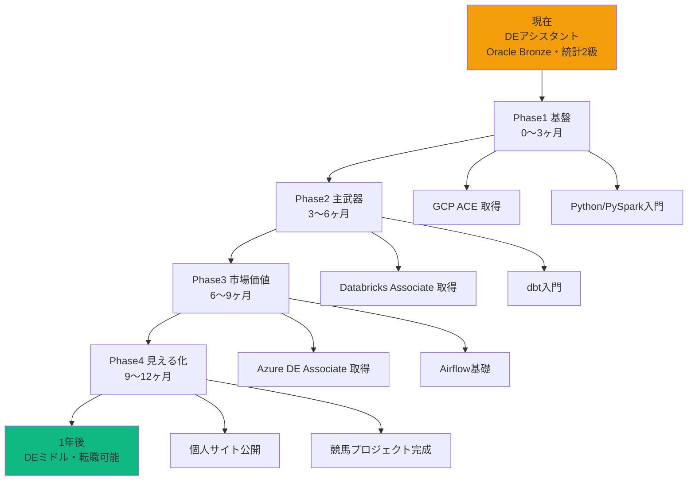
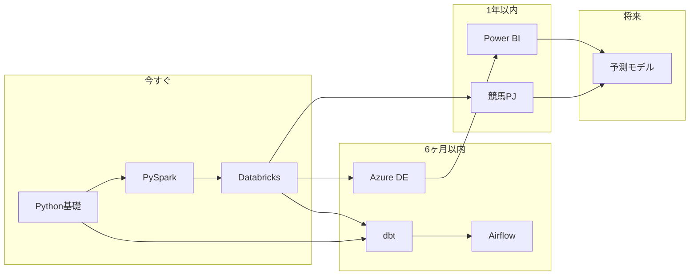

# 学習ロードマップ

## キャリア設計図

---

## 技術スタック習得順序

---

## 資格取得順序

| 優先度 | 資格 | 有効期限 | 目的 |
|-------|------|---------|------|
| **1** | GCP ACE | 2年 | 完走実績・会社要件クリア |
| **2** | Databricks Associate | 2年 | DE主武器の公式証明 |
| **3** | Azure DE Associate | 1年（更新容易）| 案件直結・市場価値 |
| 将来 | 統計検定準1級 | 5年 | 転職時の差別化 |

---

## フェーズ別週次計画

### Phase 1（0〜3ヶ月）

| 週 | 内容 | 達成確認 |
|----|------|---------|
| 1〜2 | Python基礎（型・関数・内包表記・例外）| スクリプトが書ける |
| 3〜4 | pandas（読込・集計・結合・欠損処理）| CSVを自在に扱える |
| 5〜6 | GCP ACE模擬試験 | 模擬80%安定 |
| 7 | **GCP ACE受験** | **取得** |
| 8〜10 | PySpark入門（DataFrame・read/write）| 基本操作できる |
| 11〜12 | PySpark filter・groupBy・join | 集計クエリが書ける |

### Phase 2（3〜6ヶ月）

| 週 | 内容 | 達成確認 |
|----|------|---------|
| 13〜15 | PySpark中級（UDF・Window・最適化）| 実務レベル |
| 16〜17 | Delta Lake（CRUD・Time Travel・OPTIMIZE）| 実装できる |
| 18〜19 | DLT・Auto Loader | パイプライン組める |
| 20 | Databricks模擬試験 | 模擬80%安定 |
| 21 | **Databricks Associate受験** | **取得** |
| 22〜24 | dbt入門（モデル・テスト・ドキュメント）| ローカルで動く |

### Phase 3（6〜9ヶ月）

| 月 | 内容 | 達成確認 |
|----|------|---------|
| 7 | dbt中級（incremental・source・snapshot）| 本番レベル |
| 7 | Airflow基礎（DAG・Operator・スケジュール）| DAGが書ける |
| 8 | Azure学習（ADF・Synapse・ADLS・Security）| Azure設計できる |
| 9 | Azure DE模擬試験 → **受験** | **取得** |

### Phase 4（9〜12ヶ月）

| 月 | 内容 | 達成確認 |
|----|------|---------|
| 10 | Power BI入門・競馬ダッシュボード | 可視化できる |
| 11 | 個人サイト整備・GitHub整理 | 公開状態 |
| 12 | 競馬プロジェクト完成・README整備 | ポートフォリオ完成 |

---

## 週次時間配分

| | 平日 | 休日 |
|--|------|------|
| 学習 | 1〜1.5時間 | 3〜4時間 |
| GitHub | 毎日コミット | 毎日コミット |
| 競馬研究 | Phase2以降 | Phase2以降 |
| **月計** | **45〜55時間** | |

---

## 進捗チェックリスト

### Phase 1
- [ ] Python基礎（型・関数・内包表記・エラー処理）
- [ ] pandas（読み込み・集計・結合・欠損処理）
- [ ] GCP ACE 模擬試験80%以上
- [ ] GCP ACE 取得
- [ ] PySpark DataFrameの読み書き・フィルタ・集計
- [ ] GitHub毎日コミット習慣化（30日継続）

### Phase 2
- [ ] PySpark join・UDF・Window関数・最適化
- [ ] Delta Lake CRUD・Time Travel・OPTIMIZE・VACUUM
- [ ] Delta Live Tables 基本パイプライン
- [ ] Databricks Associate 模擬試験80%以上
- [ ] Databricks Associate 取得
- [ ] dbt ローカル環境構築・モデル1本稼働

### Phase 3
- [ ] dbt モデル・テスト・ドキュメント・incremental
- [ ] Airflow DAGの作成と実行（Databricks連携）
- [ ] Azure ADF・Synapse・ADLS・Managed Identity
- [ ] Azure DE Associate 模擬試験70%以上
- [ ] Azure DE Associate 取得

### Phase 4
- [ ] Power BI 基本ダッシュボード作成
- [ ] 個人サイト公開・README整備
- [ ] 競馬データパイプライン稼働中（Bronze→Silver→Gold）
- [ ] GitHub 365日の草
